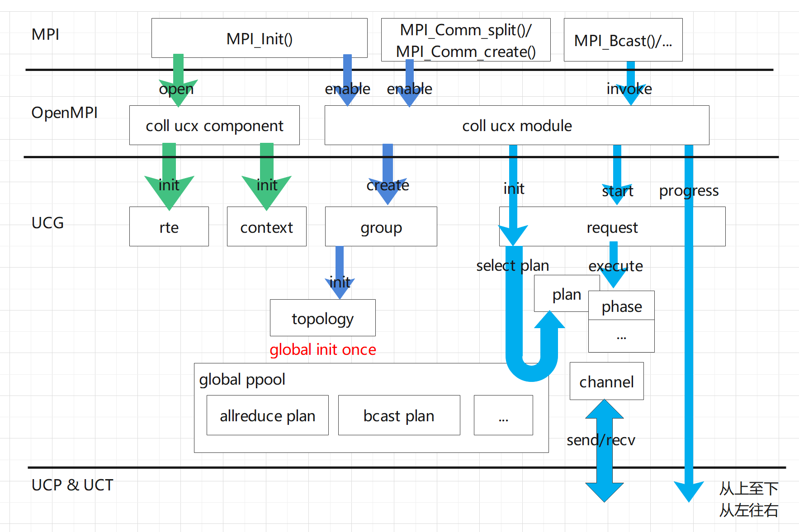

# 前言
本文档记录在重新设计和实现UCG代码的过程中的一些想法。

目标
- 简化对外接口
- 完善内部抽象
- 减少资源占用
- 插件化集合算法
- 缩短算法开发周期
- 最小化UCX改动（便于平滑更新UCX版本）

原则
1. 优先保证可读性、可维护性，除非与性能目标冲突。
2. 能通过编程技术来保证的约束，尽量不使用注释。

# 目录结构
```
├── api                               # 对外头文件目录
│   ├── ucg.h                                                
|   └── ...
├── core                              # 核心功能实现目录
│   ├── ucg_context.c                     
│   └── ...     
├── algo                             # 基础算法目录 
└── plan                             # 集合操作实现目录  

```
目录结构与UCX其他组件的风格保持一致，如api、core。

# 编码风格
使用UCX编码风格，除了对齐等号、变量，因为这样的做法由一个弊端是会在修改中增加一些无效操作，增加review成本，比如
```
a    = 0;
aaaa = 0;
```
新增一行时，前两行都需要重新调整。
```
a    ..= 0;
aaaa ..= 0; 
aaaaaa = 0;
```
> 后续有需要时，使用工具统一刷新格式。

# 抽象定义
| 名字 | 描述 | 备注 |
| --- | --- | --- |
| rte |runtime environment, UCG运行时所依赖的环境信息。| 以MPI运行环境为例，信息包括需要MPI提供的回调函数等。原先这些函数在每次创建group时传入，存在重复操作，因此定义rte统一管理这些运行环境信息，并对内部其余模块隐藏运行环境差异。 |
| context | 管理集合操作执行资源 | 目前资源为可用的plan |
| group | 集合操作通讯组 | 以MPI运行环境为例，即为`MPI_Comm` |
| request | 集合操作请求 | 将执行集合操作分为创建请求和执行请求，可实现创建一次、支持多次。 |
| plan | 基于特定算法生成的集合操作执行计划 | 所谓执行计划，实质就是指定每次收发的对象和数据，以及一些前（后）处理 |
> 以上为用户可感知的抽象

| 名字 | 描述 | 备注 |
| --- | --- | --- |
| action | 执行计划中的一个动作 | 一个plan由多个action组成 |
| ppool | plan pool，plan的管理者，可从中获取plan | 需要实现选择plan功能即最佳算法选择 |
| channel | 通讯管道 | 创建ucp ep、收发数据方式（short、bcopy、zcopy）、链路复用、am handler等等。 | 
| topology | 运行环境中所有进程的拓扑信息，主要是距离等信息。| 以MPI为例，保存MPI_COMM_WORLD内所有进程的拓扑信息 |
> 以上为内部抽象

# 名词约定
| 名词 | 描述 | 备注 |
| --- | --- | --- |
| mh | member handle，User创建Group时指定的成员标识，要求全局唯一。全局唯一的意思是该成员在不同group中使用同一个handle。 | 以MPI运行环境为例，handle可以是`ompi_proc_t*`或`MPI_COMM_WORLD rank`。链路等资源是全局复用的，直接传入全局标识省去了在使用时再转换的步骤。 |
| rank | 成员在group handles数组中的下标。 | 实现plan算法时可以使用`[0, member_count)`之间的数字来代表成员，简化算法实现。 |

# 接口约定
| 接口 | 约定 | 备注 |
| --- | --- | --- |
| ucg_request_xxx_init() | 若集合操作存在root，那么需传入root rank而非root handle。 | 通过root rank可快速找到root handle，若传入root handle则生成plan时需要遍历group handles才能得到root rank。 |

# 整体流程


# 设计想法
## datatype & op
datatype和op分为预定义和用户自定义两类，其中内部预定义可以细分为多种类型。
提供统一的接口，隐藏预定义类型和用户自定义类型的处理，对于用户自定义的类型调用用户注册的RTE函数。

## group
创建group时可以将group按照拓扑划分subgroup，如构造node leader subgroup，这可以避免后续算法中反复计算node leader subgroup。

## channel
消息头大小限制为`uint64_t`，将其分为以下几个域
```
reserved_bit(12) coll_type(8) src_rank(24) group_id(20)
header = reserved_bit << 52 | coll_type << 44 | src_rank << 20 | group_id; 
```
- `reserved_bit`预留，可作为包序、控制标识等用途
- coll_type 8 bit，可支持256种集合操作类型应当足够
- src_rank 24 bit，可支持最大1677万+进程
- group_id 20 bit, 可支持100完+通讯组

1. ucx提供包的有序传递，先发先到
2. request按plan phase有序执行
3. 收发两端的算法一致，可以保证收发对应。基于1和2，接收端只需从消息中匹配`group_id`和`src_rank`就可以找到本端的接收请求
4. `coll_type`用于缩小查找范围。

**channel感知request结构**

## ppool & plan
plan注册到全局ppool中，初始注册的plan为空plan，只包含元数据信息。克隆的plan包含配置信息、集合操作参数（成员个数、数据）、phase等。

### 简化实现的假设
实现plan时，若只认为数据是连续的，可以降低开发难度。但这有一个问题：对于非连续datatype，若算法以Byte为最小数据单位，但datatype中的最小数据单位可能大于Byte，那么算法分割数据时，在实际发送时就无法pack指定的数据长度。

问题转换成为如何设定分割数据的最小单位
1. 如果以datatype为单位，那么就不会出现问题，但可能出现count=1，但datatype很大的情况
2. 不过目前的算法实现都是以datatype为最小单位的，因此以datatype为最小单位，在功能上没有问题
3. 为了后续可以变化，将最小数据单位作为参数传递给plan，当前选择datatype。

plan总是认为buffer的起始地址为0，然后计算需要发送或接收得buffer位置，外部通过实际的buffer地址加上offset得到真实收发的buffer地址。对于非连续datatype，其pack和unpack函数的入参为offset，可获取真实数据。
```
struct {
    uin32_t *positions;
    uint32_t *lengths;
}
```

不论datatype是何种类型，让plan实现者总是基于内存是连续的前提进行开发，减少考虑的细节。
如果datatype是非连续的，plan如何来决定phase buffer？
1. 算法以datatype为单位进行phase buffer的划分。
```
// 算法只需计算offset和count即可
phase.type = RECV
phase.buffers[0] = user_buffer + datatype->size * offset
phase.lengths[0] = datatype->size * count

when recv data：
    length = 
    unpack(data, phase.buffers[0], phase.lengths[0])
```
2. 算法不以datatype为单位，而会在一个datatype中任意位置切割操作。这种实现很棘手，暂不考虑。

plan需要基于datatype+count决定phase buffer，
从底向上
1. Channel收发总是连续的
2. 实际数据位置可能是非连续的，需要通过pack()将非连续的数据放到连续的内存中
3. plan实现phase时，总是认为数据位置是连续的

### 算法
不同算法的输入并不一样
- ktree的输入是rank，root，count，degree
- rd的输入是rank，count

将phase peer和phase data分开。phase peer是由算法生成的，而phase data通常与集合操作类型有关。比如kmtree只生成phase peer，

### plan type & id
type为集合操作类型，id为该集合操作下分配的plan序号（每种type都从0开始独立计数）。用户可通过plan id指定集合操作使用的算法，如`UCX_ALLREDUCE_PLAN=0,1,2`代表限定使用allreduce的算法0、1、2。

从10000开始后续序号作为X plan的预留id。X plan通过二进制方式(libucgx.so)提供，在运行时通过UCS_MODULE_FRAMEWORK_LOAD动态加载。

### 选择plan
~~1. plan Pool通过plan的`is_available()`函数获取支持集合操作的plan。`is_available()`不止判断集合操作的参数、成员个数等，还需要判断依赖的环境是否就绪，比如Topology不可用时，topo-aware的plan不能使用。这由plan开发者保证。
2. plan Pool通过plan的`query()`函数获取信息，根据选择策略计算分数，从多个可用的plan里选择最佳plan。~~

~~`query()`提供的信息要根据选择策略来定。~~

使用决策树模式来选择plan，将选择plan的条件作为决策树的决策点明确下来，这有三点好处
1. 提高选择速度：对于不同group，可以提前根据成员个数来裁剪决策树
2. 完善算法考虑：算法开发者可将这些决策点作为查漏补缺的依据，来判断自己的算法是否符合考虑周全。
3. 减少冗余算法：若最终决策树叶子节点出现两个算法，那么就可以想想是否是决策点不足或是算法冗余。若为算法冗余，是否可以裁剪算法，是否有必要实现该算法。减少冗余算法同时也降低了使用和维护难度。

当然遇到问题或新增算法时，肯定会发现需要新的决策点，此时可将新决策点加入决策树，同时判断其余算法是否遗漏了该决策点的判断，做到发现一个问题解决一类问题。

常见的决策点：group成员个数是否大于或小于某个值、成员个数是否为2次幂、op是否满足交换律、消息大小是否大于或小于某个值等。

### 复用plan
真正的写时复制实现起来比较麻烦，因此提前将plan分为constant部分和mutable部分。对于constant部分通过指针引用，对于mutable部分通过constant部分里的指定函数初始化。phase同理。

## 配置
目前有两类配置
1. 指定集合操作算法的配置，该config table定义在ucg_context.c中。
2. 指定plan算法细节的配置，该config table定义在plan的源文件中。

为了支持User能在ucg_context_init()时指定特定的配置项，需要提供
1. ucg_config_read()获取配置项指针`ucg_config_t*`
2. ucg_config_modify()修改特定的配置项

因为两类配置是隔离的（ucg context层不能感知plan的具体配置项），所以无法将配置项字段定义在一个结构体中，只能分开获取，然后放在一个指针数组中。

因为不同plan的配置项也是隔离的，相互并不感知，所以可能出现相同table name和table prefix，甚至一样的配置项名，需要**增加检测机制**。

在ucg_config_modify()时，只有配置项名，但并不知道该配置项名属于哪个table，因此只能一个个尝试，直到设置成功。为了便利，可以约定每个table的prefix必须不一样，这样可以通过比较配置项名是否有该prefix，从而找到对应的table。

保证config_bundles中plan config的顺序与plan template数组的顺序一样，保证可以快速找到对应的plan template，并以该config实例化一个plan。


# 附录
## planner是否有存在的必要？—— 否
不同planner包含着不同的plan，一旦划分planner，那么一个planner中的plan依赖于另一个planner里的plan是相当违反直觉的，但实际中一个新算法会依赖原先的一些基础算法，而基础算法通常都位于builtin planner。因此就有了这个问题。

从用户角度看
1. 因为用户的诉求是在所有可用的plan中选择最佳的plan，所以让用户指定planner是没有意义的，用户必然指定ALL。

从实现角度看
1. 原先planner还包含了收发流程，如果不同planner包含不同的收发流程，那么确实有必要存在planner。但现在会将收发流程提炼出来，因此planner将只包含plan，就没有必要存在不同的planner。
2. plan之间本身就是隔离的，用不同的planner包含不同的plan，没什么意义。
3. 目前planner的注册方式是通过UCS FRAMEWORK LOAD，支持动态加载，因此可将以二进制形式提供的plan放在一个planner中动态加载。这可以通过别的方式来实现而无需添加新的抽象，比如源码形式提供的plan统一编译到libucg.so中，二进制形式提供的plan可编译为libucg_ext.so，直接作为一个MODULE进行加载。

## plan是否需要感知到Request？—— 否
Request可以通过plan提供的接口去执行plan，并将执行状态记录在Request中，因此plan无需感知Request。plan并不需要直接操作Request，并在其中记录特定的信息。

## 复用plan的判断逻辑
复用程度
1. SAME：plan级别复用
2. SIMILAR：phase级别复用，部分成员可能需要重新创建部分phase
3. UNEQUAL：复用plan core，所有phase都需重新创建

除了SAME，由ppool直接复用，其他两种情况由plan内部自行处理。

### bcast - tree
1. SAME：参数完全一样
2. SIMILAR：config相同 && ((plan为topo-aware && mh相同) || (plan非topo-aware && mh个数相同))
3. UNEQUAL: 除1和2之外的所有情况

> mh相同隐含着my_rank相同

1. config不同或mh个数，会影响整棵tree的生成，因此无法复用。ppool并不关注config具体内容，而是逐字节比较。
2. 若plan为topo-aware，每个member的位置是生成tree的一个条件，因此mh不同时位置信息发生变化，判断plan不可复用
3. 若plan非topo-aware，那么所有member都是等价的，只有部分my_rank发生变化的member需要重新计算。例子
```
request 1: root = 0, mh1 = {A,B,C,D}
   0             A
  / \           / \
 1   2   ==>   B   C
     |             |
     3             D

request 2: root = 0, mh2 = {B,C,E,D}，
   0             B
  / \           / \
 1   2   ==>   C   E
     |             |
     3             D

C在mh1中的my_rank=2，而在mh2中的my_rank=1，在request 1中计算得到的tree node{up=0,down=3}与request 2实际需要的{up=0}不一样，需要重新计算
D在mh1中的my_rank=3与在mh2中的my_rank一样，因此无需重新计算

request 3: root = 1, mh3 = {A,B,C,D} --switch root--> mh3 = {B,A,C,D}，A和B的my_rank需要对应的变化保持一致
   0             B
  / \           / \
 1   2   ==>   A   C
     |             |
     3             D
```


